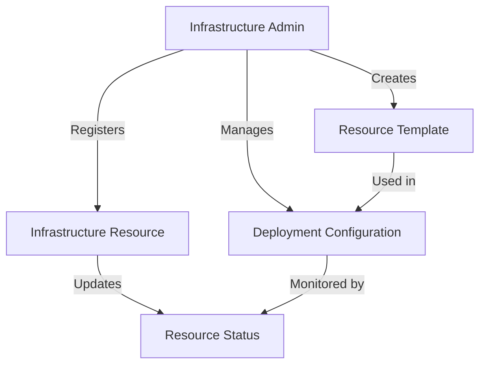

# Ethereum Infrastructure Tracker

A decentralized system for tracking and managing Ethereum infrastructure resources and deployments on the Stacks blockchain.

## Overview

Ethereum Infrastructure Tracker is a blockchain-based platform that provides transparent and verifiable management of infrastructure resources, allowing teams to track, monitor, and optimize their Ethereum deployment ecosystem.

### Key Features

- Track and register infrastructure resources
- Monitor deployment status and health
- Manage infrastructure templates
- Create and share reusable infrastructure configurations
- Validate resource utilization
- Implement role-based access controls
- Transparent and immutable infrastructure logging

## Architecture

The system leverages a smart contract to manage infrastructure tracking and management through interconnected data structures and functions.



### Core Components

1. **Infrastructure Resources**: Deployable and trackable units
2. **Resource Templates**: Shareable and configurable infrastructure blueprints
3. **Deployment Configurations**: Detailed resource setup and management
4. **Access Control**: Role-based permissions for resource management
5. **Audit Logging**: Transparent tracking of infrastructure changes

## Contract Documentation

### Resource Management

#### Registering Resources

```clarity
(register-infrastructure-resource
  name: string-ascii
  description: string-utf8
  resource-type: uint
  configuration: string-utf8
  tags: (list 10 (string-ascii 50))
) -> (response uint uint)
```

Registers a new infrastructure resource with detailed configuration.

#### Updating Resource Status

```clarity
(update-resource-status
  resource-id: uint
  status: uint
  health-metrics: string-utf8
) -> (response bool uint)
```

Updates the status and health metrics of an existing infrastructure resource.

### Template Management

#### Creating Resource Templates

```clarity
(create-resource-template
  name: string-ascii
  description: string-utf8
  resource-type: uint
  base-configuration: string-utf8
  version: string-ascii
) -> (response uint uint)
```

Creates a reusable infrastructure resource template for future deployments.

## Getting Started

### Prerequisites

- Clarinet
- Stacks Wallet
- Basic understanding of Blockchain Infrastructure Management

### Installation

1. Clone the repository
2. Install dependencies with Clarinet
3. Deploy contract to local Clarinet chain or testnet

### Basic Usage

1. Register an infrastructure resource:
```clarity
(contract-call? .infrastructure-tracker register-infrastructure-resource 
  "Ethereum Validator Node" 
  "Mainnet Validator Configuration" 
  u1 
  "{ config details }" 
  (list "mainnet" "validator"))
```

2. Update resource status:
```clarity
(contract-call? .infrastructure-tracker update-resource-status u1 u2 "{ health metrics }")
```

## Development

### Testing

Run tests using Clarinet:
```bash
clarinet test
```

## Security Considerations

### Limitations

- Resource status updates depend on external verification
- Template configurations have complexity constraints
- Role-based access requires careful management

### Best Practices

- Implement multi-signature approvals
- Regularly audit infrastructure configurations
- Use minimal and precise access controls
- Verify resource ownership before modifications